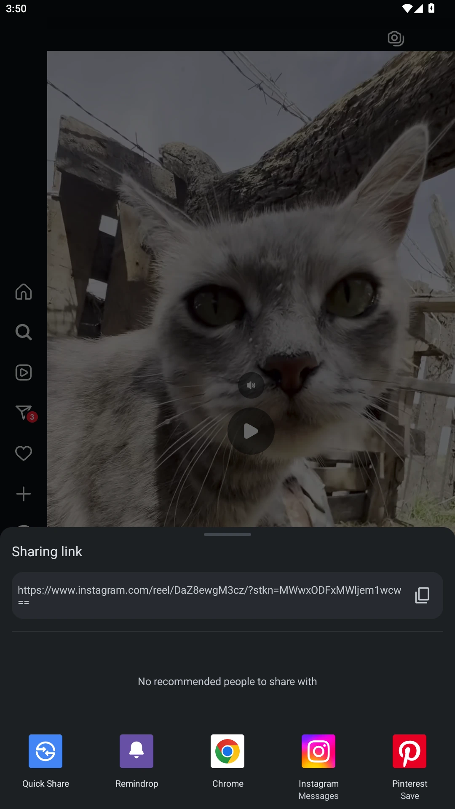
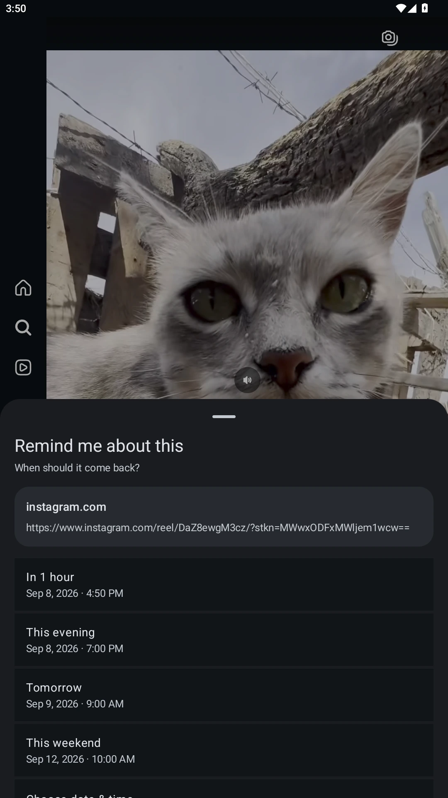
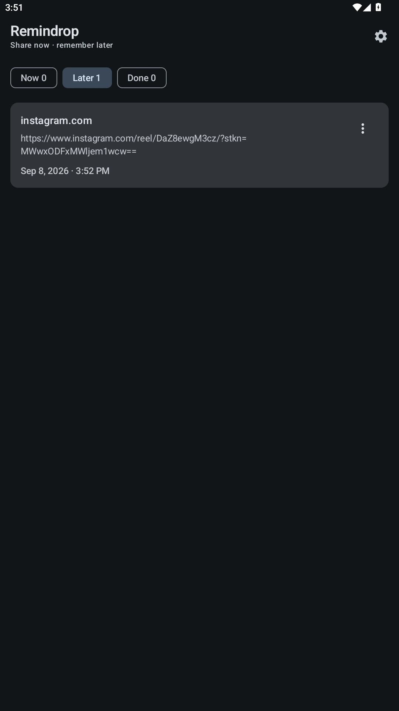

<div align="center">
  
  <h1>Remindrop</h1>
  <p><strong>Share now. Remember later.</strong></p>
</div>

Remindrop is a lightweight, privacy-first Android app for turning anything you can share into a local reminder.

See a Reddit post, video, article, product, message, or piece of text you want to revisit? Use Android's Share menu, choose **Remindrop**, pick a time, and return to what you were doing. Remindrop will bring it back later with a local notification.

## Screenshots

<p align="center">
  
  
  
  
</p>

## Why Remindrop

- **Fast share flow:** Share → Remindrop → choose a time → done
- **Local-only:** reminders are stored on the device
- **No account:** no sign-up or sync setup
- **No trackers:** no analytics, ads, telemetry, or crash-reporting SDKs
- **No cloud:** no backend, server, API key, or push provider
- **No Internet permission:** the app cannot upload your reminder data
- **Battery-friendly:** no background service and no polling loop
- **Small storage footprint:** reminders are stored as a compact local JSON file
- **Android 7.0+:** supports API 24 and newer
- **Material 3 / Material You:** dynamic system colors on Android 12+
- **17 languages:** includes Arabic, English, Simplified and Traditional Chinese, Spanish, Portuguese, French, German, Russian, Japanese, Korean, Hindi, Indonesian, Turkish, Italian, Polish, and Vietnamese

## Features

- Receive shared text and links from other Android apps
- Also appears in Android's selected-text actions via **Process text**
- Quick reminder presets:
  - In 1 hour
  - This evening
  - Tomorrow
  - This weekend
  - Custom date and time
- Clean organizer with **Now**, **Later**, and **Done** sections
- Open saved links in their original app or browser
- Mark reminders as done
- Snooze reminders for 30 minutes, 1 hour, this evening, tomorrow, or a custom time
- Delete reminders locally
- Notification actions for **Done** and **Snooze**
- Pending reminders are restored after a device reboot or app update
- Optional system battery-settings shortcut for OEMs with aggressive battery restrictions

## Battery and reliability

Remindrop does not run a permanent service and does not periodically wake the device. It schedules each reminder through Android's `AlarmManager` using `setAndAllowWhileIdle`, which is designed to work with Doze while avoiding the exact-alarm permission and unnecessary battery use.

Some manufacturers such as Xiaomi, Samsung, Tecno, Infinix, Oppo, Vivo, and others can apply additional battery restrictions. Remindrop avoids manufacturer-specific hacks; instead it exposes the standard Android app settings so users can remove heavy battery restrictions only if their device delays reminders.

## Permissions

Remindrop requests only:

- `POST_NOTIFICATIONS` on Android 13+ so it can show reminders
- `RECEIVE_BOOT_COMPLETED` so pending reminders can be restored after a reboot

It intentionally does **not** request:

- Internet
- Photos or files
- Location
- Contacts
- Camera
- Microphone
- Advertising ID

Android backups are disabled for the app, so reminder data is not placed into Android cloud backup by Remindrop.

## Build locally

Requirements:

- JDK 17
- Android SDK 35
- Gradle 8.9

```bash
gradle --no-daemon :app:assembleDebug
```

The APK will be created at:

```text
app/build/outputs/apk/debug/app-debug.apk
```

## Build on GitHub

GitHub Actions builds and verifies the project on every push and pull request. CI builds the debug APK, builds the minified release variant, runs Android Lint, reports APK sizes, and uploads both the debug APK and the **unsigned** release build as artifacts.

The unsigned release artifact is for build/size verification only. Use a signed GitHub Release for normal installation and updates.

The CI build uses only GitHub-hosted runners and official GitHub/Gradle setup actions. No Remindrop server is involved.

## Production releases

The Release workflow creates a minified, resource-shrunk, signed APK, verifies its Android signature, generates a SHA-256 checksum, and publishes both files in GitHub Releases.

A persistent private signing key is required once so future APK updates keep the same Android signature. The key is supplied only through GitHub Actions secrets and is never committed to the repository.

After the signing secrets are configured you can either push a `v*` tag or open **Actions → Release → Run workflow** and enter a tag such as `v0.1.2`.

See [docs/RELEASING.md](docs/RELEASING.md) for the one-time signing setup and release process.

## F-Droid

Remindrop is prepared for submission to the official F-Droid repository. Upstream Fastlane metadata is included for the store listing and changelogs, and a starter fdroiddata metadata file is included under `packaging/fdroid/`.

See [docs/F-DROID.md](docs/F-DROID.md) for the exact submission process.

## Contributing

Contributions are welcome, including **AI-assisted contributions**. AI-generated or AI-assisted changes must still follow Remindrop's project rules and be reviewed and understood by the contributor before submission.

Read [CONTRIBUTING.md](CONTRIBUTING.md) before opening a pull request. It contains the required rules for AI-assisted work, privacy, dependencies, localization, Android compatibility, and verification.

## Privacy

See [PRIVACY.md](PRIVACY.md).

## License

Remindrop is licensed under the **GNU General Public License v3.0**. See [LICENSE](LICENSE).
